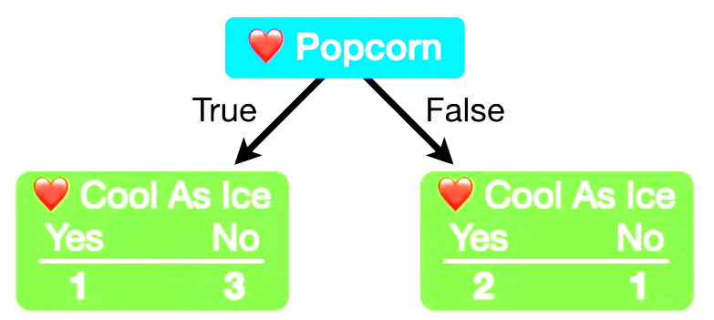
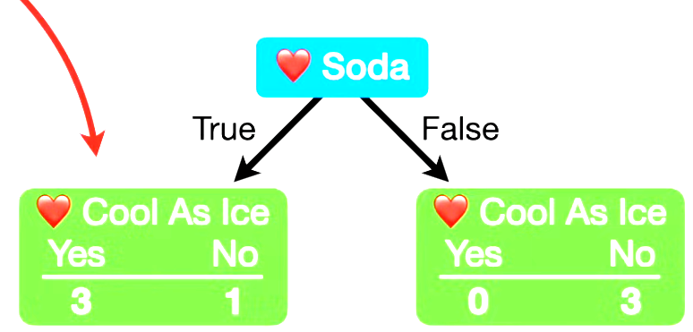

# Decision Tree

Decision trees are often used in marketing or biomedical industries as the tree-based structure is similar to sales or diagnosis use cases. Hence, when using decision tree as key component of the ensemble method, one could get random forest or gradient boosted decision tree models, etc. Fully grown decision tree model has its characters of being direct and easy-to-explain, hence it would be also important as the ensemble method section prerequisites. Overall, the formulation of decision tree involves 1) feature selection, 2) tree construction and 3) tree pruning.

## Structuring a Decision Tree

A decision tree starts at a node, called root, which breaks down into branches. Each branch then further splits into more branches, building a hierarchical network. The final branches with no more splits are referred to as leaf nodes.

## Understanding Gini Index

_**Note**_: A more clear explanation can be found in videos:
- [StatQuest: Decision and Classification Trees, Clearly Explained!!!](https://www.youtube.com/watch?v=_L39rN6gz7Y&t=18s)
- [StatQuest: Decision Trees, Part 2 - Feature Selection and Missing Data](https://www.youtube.com/watch?v=wpNl-JwwplA)
- [StatQuest: How to Prune Regression Trees, Clearly Explained!!!](https://www.youtube.com/watch?v=D0efHEJsfHo)

A Gini Index endeavors to quantify the disorder within these groups. A greater Gini Index score signifies more disorder. The formula of Gini Index can be represented as $G = 1-\sum_{i=1}^n p_i^2$ where $G$ is the Gini index or coefficient, $p_i$ is the proportion of individuals in the $i$th group, and the sum is taken over $n$ groups. Gini index is used to describe the data purity, which has similar concept with information entropy.

$$\text{Gini}(D) = 1 - \sum_{k=1}^n(\frac{C_k}{D})^2$$

$$\text{Gini}(D|A) = \sum_{i=1}^n\frac{|D_i|}{|D|}\text{Gini}(D_i)$$

Now let's use an example to better understand how to compute Gini index:

|     | Loves Popcorn | Loves Soda | Age | like movie |
| --- | ------------- | ---------- | --- | ---------- |
| A   | Y             | Y          | 7   | N          |
| B   | Y             | N          | 12  | N          |
| C   | N             | Y          | 18  | Y          |
| D   | N             | Y          | 35  | Y          |
| E   | Y             | Y          | 38  | Y          |
| F   | Y             | N          | 50  | N          |
| G   | N             | N          | 83  | N          |

|                               Loves Popcorn                                |                                 Loves Soda                                 |
| :------------------------------------------------------------------------: | :------------------------------------------------------------------------: |
|  |  |

All the three leaves except for the fourth one are called impure leaves, where the fourth one is called a pure leaf node. As both leaf nodes from `loves Popcorn` are impure but there is only one node from `Loves Soda` being impure, it means that the `Loves Soda` does a better job predicting who will and will not the movie.

$$\text{Gini Impurity for a leaf} = 1 - (\text{the probability of "Yes"}) ^ 2 - (\text{the probability of "No"}) ^ 2$$

$$\text{Gini Impurity (Loves Movie | Loves Popcorn)} = 1 - (\frac{1}{1+3})^2 - (\frac{3}{1+3})^2 = 0.375$$

$$\text{Gini Impurity (Loves Movie | Hates Popcorn)} = 1 - (\frac{2}{1+2})^2 - (\frac{1}{1+2})^2 = 0.444$$

$$\text{Total Gini Impurity} = \text{weighted avg of Gini for the leaves} = (\frac{1+3}{1+3+2+1})\cdot(0.375)+\frac{3}{4+3}(0.444)$$

## Implementation of Decision Tree Splits

```python
groups = [
    [['Red'], ['Blue'], ['Red']],
    [['Blue'], ['Red'], ['Blue'], ['Blue']],
]
classes = ['Red', 'Blue']

n_instances = float(sum([len(group) for group in groups]))

def gini_index(groups, classes):
    n_instances = float(sum([len(group) for group in groups]))
    gini = 0.0
    for group in groups:
        size = len(group)
        if size == 0:
            continue
        score = 0.0
        for class_val in classes:
            p = [row[-1] for row in group].count(class_val) / size
            score += p * p  # summed probabilities, 1 - score = gini impurity
        gini += (1.0 - score) * (size / n_instances)
    return gini
    
def test_split(index, value, dataset):
    left, right = list(), list()
    for row in dataset:
        if row[index] < value:
            left.append(row)
        else:
            right.append(row)
    return left, right
```

## Information Gain

### Max Information Gain

For a sample set D, there are K categories, the empirical entropy for this set D can be expressed as $H(D) = -\sum_{k=1}^K \frac{|C_k|}{D}\log_2\frac{C_k}{D}$.

## Related Topics

- **[Linear Regression](linear_regression.md)** - Alternative regression algorithm
- **[Model Evaluation](../model_evaluation/metrics_and_validation.md)** - Evaluating decision trees
- **[Feature Engineering](../feature_engineering/data_types_and_normalization.md)** - How decision trees handle different data types
